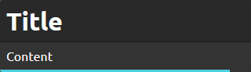

# SimpleNotification

*SimpleNotification* is a library to display simple yet customizable notifications.

## Installation

You simply need to include ``simpleNotification.css`` (or it's minified version), ``simpleNotification.js`` and you're ready to go !

## How to use

*SimpleNotification* has static methods to display notifications, and there is 5 default templates.  
You can call each templates by their name directly on ``SimpleNotification`` without instantiating it, for example: ``SimpleNotification.succes(...)``.

| Name | Result |
|---|---|
| success |  |
| info |  |
| error |  |
| warning |  |
| message |  |

Each functions have the same parameters:

| Name | Description |
|---|---|
| title | (Optional) The title of the notification. |
| text | (Optional) The content of the notification. |
| options | (Optional) The parameters for this notification. |

You can use custom classes and make your own design by using ``SimpleNotification.custom(classes, title, text, options)`` where classes is an array of CSS classes that will be added to the body of each notifications.

Both ``title`` and ``text`` are optional, but you need to set at least one of the two.  
You can jump line inside the notification content by using ``\r\n``.

## Options

There is a few options that you can set by using ``SimpleNotification.options(object)`` or more specifically for a single notification on the third parameter.

| Name | Description |
|---|---|
| duration | The time that the notification is displayed. |
| fadeout | The duration of the fadeout animation when the notification display time is over. |
| position | Valid positions: ``top-left``, ``top-right``, ``bottom-left`` and ``bottom-right``. |
| sticky | If set to true, the notification will not disappear until the user click it. |
| image | Add an image next to the notification content. |